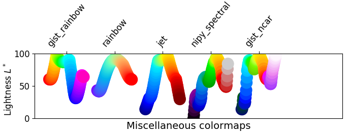
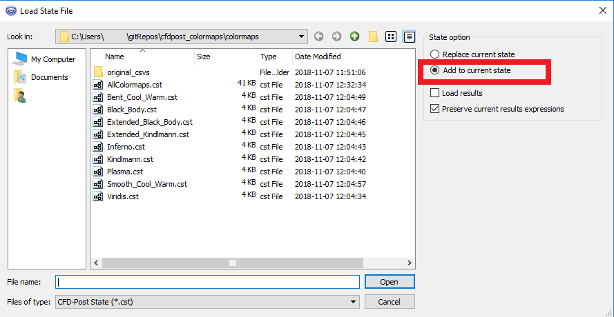
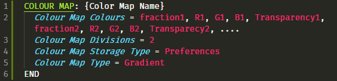

# cfdpost_colormaps
#### Working in ANSYS Fluent? Check out [fluent_colormaps](https://github.com/u2berggeist/fluent_colormaps)!
#### Work with `.ccl`'s and `.cst`'s? Check out my VS Code Extension for Language Support, [ANSYS CFX](https://marketplace.visualstudio.com/items?itemName=u2berggeist.cfxlanguage)!

## Why Colormaps?

Because rainbow is bad. 

To start, what are colormaps for? They're a visualization tool. They attempt to communicate a change in numerical value from a sample set by changing color. The "greater" the change in color, the greater the change in numerical value. 

The rainbow is a linear scale of light wavelengths. *However*, how humans perceive a rainbow scale is **not** linear. In fact, the correlation between the perceived color change in a rainbow colormap and the actual numerical change is quite poor. 

There are several instances where professionals have made incorrect conclusions from rainbow-based visualizations. Doctors have been found to make better diagnoses by using alternate colormaps:

> In tests, diagnostic accuracy, as measured by the proportion of diseased areas identified, increased dramatically with the new color scheme. [Source](https://phys.org/news/2011-10-heart-disease-visualization-experts-simpler.html)

and climate scientists have misinterpreted their own data by using rainbow colormaps:

>  The same sub-tropical ‘front’ is apparent in rainbow, but far less clear in the sequential scheme.... [the sub-tropical 'front'] is a mirage, an artefact of the choice of colour scale. [Source](http://www.climate-lab-book.ac.uk/2016/why-rainbow-colour-scales-can-be-misleading/)

See [this article](https://matplotlib.org/users/colormaps.html) from matplotlib that details more about the issues in colormaps. In particular, compare the plots of perceptually uniform colormaps and the more common colormaps from the same page (the lower plot in particular). These are plotted based on perceived brightness, so linear is the goal. As you can see, rainbow and the like are quite poor.

Bottom line: don't use rainbow. \#endrainbow

## Ok, so what is this repository?

Here are tools that allow users to use different color maps in ANSYS CFD Post without having to enter then in manually or have them buried in a `.cst` file.

The example colormaps are taken from [Kenneth Moreland's webpage](https://www.kennethmoreland.com/color-advice/) on color map advice*. These colormaps are generally recommended over the default ones available in CFD Post.

Examples of the different colormap options are in [`Examples.md`](./Examples.md) or [this imgur album](https://imgur.com/a/hL35KCY). This is an axisymmetric CFD simulation with flow going right to left. Notice the differences in the appearance of turbulence. 

I've also written up a simple Python script that will translate CSV's into the correct format for this process. It is commented with instructions.

\*Note that the "Extended Black Body" colormap used to be posted on Kenneth's website (though it is still available on [GitHub](https://github.com/kennethmoreland-com/kennethmoreland-com.github.io/tree/master/color-advice)). After discussion with Kenneth over email, it was dropped in favor of "Inferno" as they're both very similar to each other, with "Inferno" being the more rigorously vetted option. That said, "Extended Black Body" isn't bad, just maybe not as good as "Inferno".

## Use:
Simply import the `.cst` with the colormap of your liking to use it, or import `AllColormaps.cst` to get all of them. 

To get the files, you can either clone the repository, download the repository as a zip, or just download the individual `.cst` files you need. 

#### WARNING: If you do not have "Add to existing state" selected in the loading state dialog box in CFD Post **YOU WILL LOSE YOUR WORK**. Remember, when in doubt, save before doing anything else.

## Color Map Format:

Above is an example of the general format for the `.cst` files. (Syntax highlighting provided by [ANSYS CFX](https://marketplace.visualstudio.com/items?itemName=u2berggeist.cfxlanguage) VS Code Extension)

#### `COLOUR MAP`:
This is simply the header for the colormap section of the `.cst` The word to the right of the ':' is the display name of the colormap.

#### `Colour Map Colours`:
Simply a list of all the color map points. There are 5 floats per color point: fraction value, percentages for Red, Green, and Blue respectively, and then the transparency percentage. My current translation script makes transparency equal to 1 for all (so completely opaque).

#### `Colour Map Divisions`:
No idea what this does. All of the default maps have it set to 2, so I followed suit.

#### `Colour Map Storage Type`:
Not quite sure what exactly this one does either. From what I can tell, it simply specifies whether it is a default ANSYS colormap or a custom one. Why ANSYS can't just let the header be the determining factor on that is beyond me.

#### `Colour Map Type`:
Specifies that the map is a gradient between different color points. This as opposed to zebra type color map.